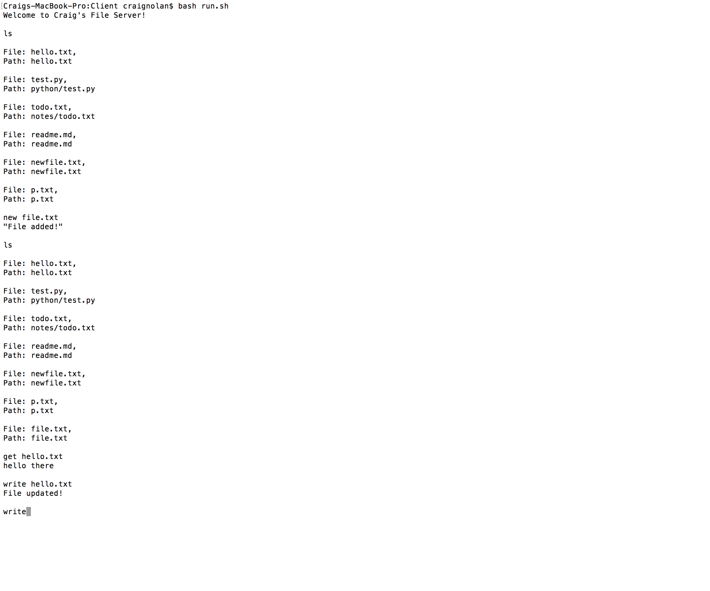
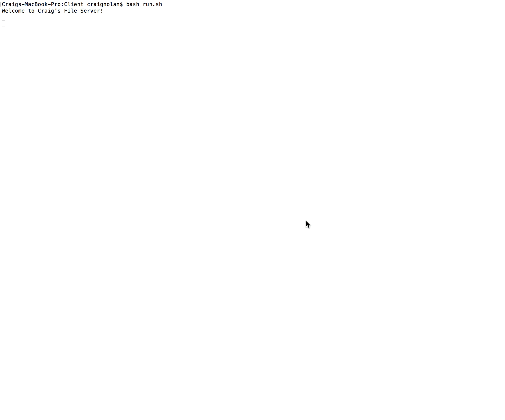

# Distributed File Server
## Introduction
This project is a distributed file server where each aspect of the service is separated into its own distributed sever and accused by REST API’s. I implemented 4 distributed services. These include : 

1. File Service
2. Directory Service
3. File Locking Service
4. File Caching

I developed this project using Persistent MySQL library which allowed for easy database migrations in the code. This took some time to setup but made development with databases much easier once it was setup. Below I will discuss and showcase user interaction with the Distributed File Server and how users/other services interact with each other.

## File Service
My file server is the heart of the project. This is where files are stored and sent back to users to read and write. I made use of a “dumb” file server which stores a ‘files’ directory locally and this is where files are served from this service. A user enters the path they wish to read or write from and the file service then tries to serve back this file for reading/writing if it is there and throws and error otherwise.

I will showcase read and writes in the section in directory service because they are closely intertwined and both make use of file paths.

## Directory Service
The directory service provides a lookup mechanism for the client where they can see which files are in which directory and also use this to read and write these files in their respective directories. To keep track of what’s where, I kept a MySQL database of file information with one table of the following information:

Files

| Name | Path | Last_Write_Time |
| ---- | ---- | --------------- |
| hello.txt | /hello.txt | 2017-12-15 17:38:26 |

This information is used for listing all files in the server and also the last write time is used for caching which will be discussed later.

### User Listing, Getting and Writing to Files

#### Listing Command 


#### Get Command
 

#### Write Command


## Locking Service
The locking service is used to lock files while a user is writing to a file on a particular file location. This ensures that a file’s copy is the only copy that is being written to and therefore stops write conflicts with files. I implemented this by keeping track of lock details in a MySQL database again with one table keeping the following information:

Locks

| FilePath | isLocked |
| -------- | --------- | 
| /hello.txt | 0 |

I keep the file path of the file to be checked and map a haskell boolean value to a MySQL TINYINT to determine if the file is locked or not. If the file isn’t locked, the client can write what they want to a file and are declined access to the file they request if it has been locked by another client on the server. Once a client is finished writing to the file, they release the lock and others can now write to that previously locked file

### User Locking Demonstration

#### User Locking By Writing



#### User Being Refused Access to a Locked File

 

## Caching
This system makes use of caching on the client side where they create an in memory cache using Software Transactional Memory (necessary for haskell given its immutability). 

If a user writes to/creates a file and when a get request is made for a file their cache is checked, if it’s there we need to check this file version against the stored version on the file server. I do this by comparing write timestamps on each of the cache and directory service’s database. If the server’s timestamp is newer than the cache’s, get the file from the database and cache the newer version. If not, just read the file from the cache. This saves the client from requesting the file server every time it needs to read a file and helps lower networks traffic.

I make use of this function to cache a file where I use the file path as the key and a tuple of the file contents and a timestamp and the values returned upon look up.

```haskell
cacheFile :: Cache String (String, UTCTime) -> String -> File -> IO ()
cacheFile cache path file = do
    time <- getCurrentTime
    insert cache path (fileContents file, time)
```

## Client Implementation
To test this file server, I created a simple client to be run in the command line to list, read, write and create new files. The caching facility is also done on the client side in memory. The client can use the following commands to use the file server:

```
ls 					          - To list all files in the directory
get <filepath>		  - Get the file contents on the given path
write <filepath>		- write to a file on the given path
new <filepath>		  - create a new file on the given path
quit					         - logout
```

From here the client calls the multiple API’s to get the information they’re looking for and to perform certain actions such as locking on writes.

## Running This Project
Each subfolder in this project is a stack project, so you need to do the following :
* `git clone https://github.com/craig1901/Distributed-File-Server/`
* `stack build` on each stack project
* `bash run.sh` on each service before you run the client and the run the same command in that folder
